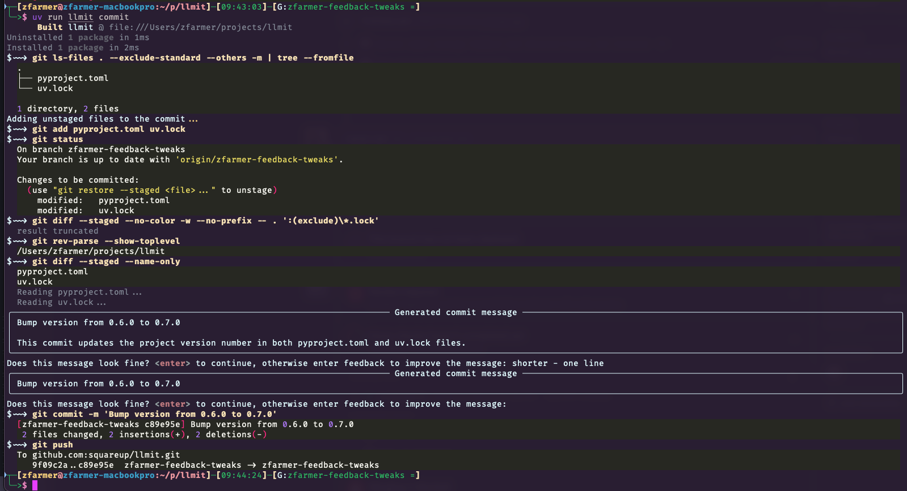

# DiffWeave

DiffWeave is a tool for automatically generating commit messages using large language models (LLMs). 
The goal is for this tool to be intuitive to use and to help you write meaningful commit messages.



For details on setting up models and the configuration file, see the
[Getting Started](installation.md) page. 

## CLI Reference

The `diffweave-ai` CLI is exposed as a uv tool. You will most commonly invoke it as:

```bash
uvx diffweave-ai [OPTIONS]
```

From a local checkout of this repository, you can also run it via:

```bash
uv run diffweave-ai [OPTIONS]
```

### Top-level behavior

Running `diffweave-ai` with no subcommand starts the interactive commit flow:

- Shows the current git status.
- Optionally stages files for you (interactive by default).
- Generates a commit message using your configured model.
- Lets you review and refine the message.
- Attempts `git commit`.
- Optionally attempts `git push` and can open the repo in your browser if requested.

Key flags:

- `--model, -m MODEL` – choose which configured model to use.
- `--simple, -s` – use a simpler, non-Conventional-Commits style.
- `--dry-run` – show the generated commit message and exit without committing.
- `--non-interactive` – run without prompts, using the first generated message.
- `--verbose, -v` – print additional logging.
- `--open-browser, -w` – attempt to open the repo in your browser after pushing.
- `--config PATH` – explicit path to the diffweave config file.

### Subcommands

`diffweave-ai` also provides a few focused subcommands:

- `add-model` – register or update a custom LLM model configuration.
  - Flags: `--model, -m`, `--token, -t`, `--endpoint, -e` (default `https://api.openai.com/v1/responses`), `--config, -c`.
- `list-models` – list all configured LLM models.
  - Flags: `--config`.
- `set-model` – set the default LLM model used by the CLI.
  - Args: `MODEL_NAME` (positional). Optional: `--config`.
- `pr` – generate a Pull Request description based on your local changes.
  - Flags: `--branch BRANCH` (default `main`), `--model, -m`, `--verbose, -v`, `--config, -c`.

You can always view the latest help by running:

```bash
❯ uvx diffweave-ai -h
Usage: diffweave-ai COMMAND [ARGS]

Generate a commit message for the current state of the repository.

Default behavior (with no arguments) is an interactive flow that:

 • Shows the current git status.
 • Optionally stages files for you (interactive by default).
 • Generates a commit message using your configured model.
 • Lets you review and refine the message.
 • Attempts git commit
 • Attempts git push
 • Attempts to open the repository in the browser window if requested

Depending on flags, the command can run purely as a dry run, perform a full commit and optional push, or operate in a non-interactive mode suitable for scripts.

Note: Be sure to configure your LLM provider before use.

╭─ Commands ──────────────────────────────────────────────────────────────────────────────────────────────────────────────────────────────────────────────────────────────────────────────╮
│ add-model    Register or update a custom LLM model configuration.                                                                                                                       │
│ list-models  List all configured LLM models.                                                                                                                                            │
│ pr           Generate a Pull Request                                                                                                                                                    │
│ set-model    Set the default LLM model used by the CLI.                                                                                                                                 │
│ --help -h    Display this message and exit.                                                                                                                                             │
│ --version    Display application version.                                                                                                                                               │
╰─────────────────────────────────────────────────────────────────────────────────────────────────────────────────────────────────────────────────────────────────────────────────────────╯
╭─ Parameters ────────────────────────────────────────────────────────────────────────────────────────────────────────────────────────────────────────────────────────────────────────────╮
│ MODEL --model -m                                        Name of the LLM Model to use                                                                                                    │
│ SIMPLE --simple --no-simple -s                          Use simpler commit structure for messages (not conventional commits) [default: False]                                           │
│ DRY-RUN --dry-run --no-dry-run                          Generate a commit message based on the current repo status, print to stdout, and quit. [default: False]                         │
│ NON-INTERACTIVE --non-interactive --no-non-interactive  Run in non-interactive mode. Similar to dry run except we then use that first commit message that comes back. [default: False]  │
│ VERBOSE --verbose --no-verbose -v                       Show verbose output [default: False]                                                                                            │
│ OPEN-BROWSER --open-browser --no-open-browser -w        Open repository in browser window [default: False]                                                                              │
│ CONFIG --config                                         Path to config file                                                                                                             │
╰─────────────────────────────────────────────────────────────────────────────────────────────────────────────────────────────────────────────────────────────────────────────────────────╯
```
```
